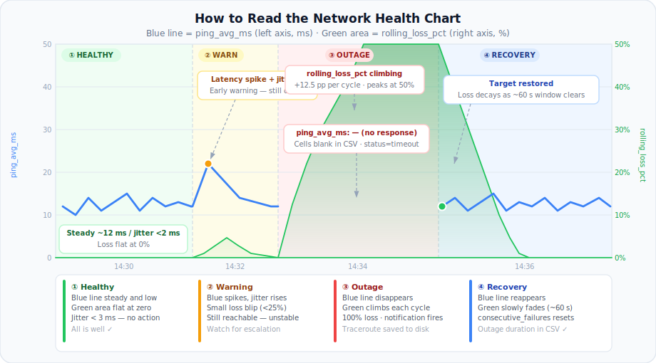
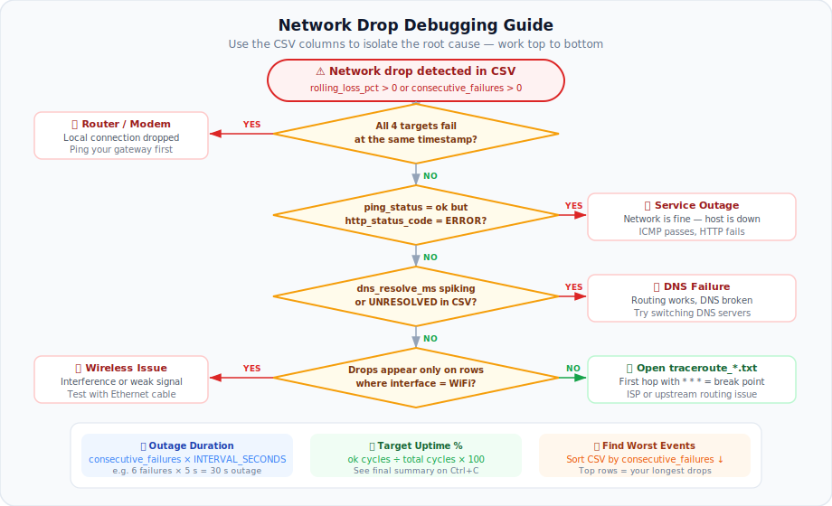

# 🌐 network_monitor.py

A zero-dependency Python script that continuously pings a list of IP addresses
and hostnames, records detailed health metrics to a timestamped CSV, and prints
a configurable summary to the terminal. Designed to run for days or months
unattended to diagnose intermittent network drops.

---

## Features

| Feature | Detail |
|---|---|
| ICMP ping | min / avg / max latency + jitter per cycle |
| DNS resolution timing | Separate from ICMP — distinguishes DNS failures from routing failures |
| HTTP/HTTPS check | Catches hosts that silently block ICMP pings |
| Rolling packet-loss % | Sliding window (default: last 60 s) — smooths blips vs real outages |
| Consecutive failure counter | Per-target streak count |
| Active interface tagging | WiFi / Ethernet / unknown, tagged on every CSV row |
| Dual-interface monitoring | Pings each target via WiFi **and** Ethernet simultaneously — directly isolates wireless drops without guessing |
| Traceroute snapshot | Auto-fires on first failure per target, saved as a `.txt` sidecar |
| macOS notification | Desktop alert after N consecutive failures |
| Three output modes | Verbose, Quiet (hourly), Silent |
| Exit summary | Per-target uptime % printed on Ctrl+C |

---

## Requirements

- **macOS** (uses `ping`, `traceroute`, `networksetup`, `ipconfig`, `osascript`)
- **Python 3.10 or later** — no pip installs required, pure stdlib

```bash
python3 --version   # must be 3.10+
```

---

## Quick Start

```bash
# 1. Edit the TARGETS list at the top of the script
# 2. Run it
python3 network_monitor.py
```

The script creates a timestamped CSV in the same folder it is run from:

```
network_health_20260518_143000.csv
```

If a target fails, a traceroute snapshot is also saved alongside it:

```
traceroute_75.75.76.76_20260518_143527.txt
```

---

## Configuration

Edit the `CONFIG` block near the top of `network_monitor.py`:

```python
TARGETS: list[str] = [
    "8.8.8.8",       # Google Public DNS  — good baseline, rarely goes down
    "apple.com",     # External hostname  — exercises DNS resolution + routing
    "75.75.75.75",   # Comcast DNS (primary)
    "75.75.76.76",   # Comcast DNS (secondary)
    # "192.168.1.1", # Uncomment to add your router / gateway
]

INTERVAL_SECONDS       = 5    # Seconds between each full ping cycle.
                               # Doubles in effective work when MONITOR_ALL_INTERFACES=True.

PING_COUNT             = 4    # Pings per burst — avg / jitter calculated across these.
                               # Higher = more accurate jitter, slower cycle.

PING_TIMEOUT_SECONDS   = 2    # Per-ping timeout in seconds.
                               # Any ping exceeding this counts as 100% loss for that packet.

ROLLING_WINDOW         = 12   # Window for rolling_loss_pct — in SAMPLES, not seconds.
                               # Effective window = ROLLING_WINDOW × INTERVAL_SECONDS
                               # Default: 12 × 5 s = 60 s. Adjust if you change INTERVAL_SECONDS.

HTTP_TIMEOUT_SECONDS   = 3    # Timeout for the HTTP HEAD check in seconds.
                               # Set to 0 to disable HTTP checks entirely.

ALERT_AFTER_FAILURES   = 3    # Consecutive 100%-loss cycles before a macOS notification fires.
                               # Tracked per target AND per interface independently.

OUTPUT_DIR             = Path(".")  # Where CSV and traceroute files are written.
                                    # "." = the folder you run the script from.

MONITOR_ALL_INTERFACES = True  # True  — ping via WiFi AND Ethernet simultaneously.
                                #         Two CSV rows per target per cycle (one per interface).
                                #         Falls back to one interface if only one is active.
                                # False — use the first active interface found only.
                                #         Typically Ethernet on a Mac mini, WiFi on a MacBook.
```

---

## Output Modes

Run with `-h` to see all options:

```
python3 network_monitor.py -h
```

### Default — Quiet (hourly summary)

Best for long unattended runs. The terminal is silent except for one block
printed on the hour and whenever a traceroute fires.

```bash
python3 network_monitor.py
```

```
━━━━━━━━━━━━━━━━━━━━━━━━━━━━━━━━━━━━━━━━━━━━━━━━━━━━━━━━━━━━━━
  🌐  Network Monitor  —  4 target(s)
  🔌  Interfaces:  WiFi (en0)  +  Ethernet (en1)
  ⏱   Interval: 5s   Pings/cycle: 4
  🖥   Output mode: quiet    (hourly summary)
  📄  CSV: /path/to/network_health_20260518_143000.csv
  Press Ctrl+C to stop
━━━━━━━━━━━━━━━━━━━━━━━━━━━━━━━━━━━━━━━━━━━━━━━━━━━━━━━━━━━━━━
```

The script then runs silently. On the hour (and on Ctrl+C) it prints one block **grouped by interface** — this is where you see WiFi vs Ethernet at a glance:

```
────────────────────────────────────────────────────────────────────────
  HOURLY SUMMARY   2026-05-18 14:00 → 15:00
────────────────────────────────────────────────────────────────────────

  WiFi (en0)
  ✅ 8.8.8.8              uptime=100.0%  avg=11.4ms   max=22.1ms   drops=0
  ✅ apple.com            uptime=100.0%  avg=19.8ms   max=31.4ms   drops=0
  ✅ 75.75.75.75          uptime=100.0%  avg=13.9ms   max=24.6ms   drops=0
  ❌ 75.75.76.76          uptime= 70.0%  avg=15.2ms   max=25.2ms   drops=144   worst_streak=6

  Ethernet (en1)
  ✅ 8.8.8.8              uptime=100.0%  avg=9.1ms    max=18.3ms   drops=0
  ✅ apple.com            uptime=100.0%  avg=17.2ms   max=28.1ms   drops=0
  ✅ 75.75.75.75          uptime=100.0%  avg=11.8ms   max=22.4ms   drops=0
  ✅ 75.75.76.76          uptime=100.0%  avg=10.3ms   max=21.6ms   drops=0
────────────────────────────────────────────────────────────────────────
```

Same target, same hour — WiFi drops while Ethernet stays clean. **Wireless problem confirmed.**

**Pressing Ctrl+C** flushes the current partial hour before printing the
all-time session summary, so you never lose data.

---

### `-v` — Verbose (one line per cycle)

Best for active debugging sessions where you want to watch results in real time.

```bash
python3 network_monitor.py -v
```

```
  ✅ WiFi (en0)       8.8.8.8              avg=11.8ms   loss=  0.0%  roll=  0.0%  fail=0
  ✅ WiFi (en0)       apple.com            avg=19.5ms   loss=  0.0%  roll=  0.0%  fail=0   jitter=1.2ms
  ✅ WiFi (en0)       75.75.75.75          avg=14.2ms   loss=  0.0%  roll=  0.0%  fail=0
  ❌ WiFi (en0)       75.75.76.76          avg=     —   loss=100.0%  roll= 30.0%  fail=3

  ✅ Ethernet (en1)   8.8.8.8              avg=9.4ms    loss=  0.0%  roll=  0.0%  fail=0
  ✅ Ethernet (en1)   apple.com            avg=17.1ms   loss=  0.0%  roll=  0.0%  fail=0   jitter=0.9ms
  ✅ Ethernet (en1)   75.75.75.75          avg=12.0ms   loss=  0.0%  roll=  0.0%  fail=0
  ✅ Ethernet (en1)   75.75.76.76          avg=10.8ms   loss=  0.0%  roll=  0.0%  fail=0

  [2026-05-18T14:30:45]  cycle=9.81s
```

---

### `-q` — Silent

Zero terminal output during the run. macOS notifications still fire on
failures. The full session summary is printed on Ctrl+C.

```bash
python3 network_monitor.py -q
```

Useful when running in a background terminal or via `launchd` / `nohup`.

```bash
# Example: run silently in the background, log terminal output to a file
nohup python3 network_monitor.py -q > monitor.log 2>&1 &
```

---

## CSV Column Reference

| Column | Type | Description |
|---|---|---|
| `timestamp` | ISO-8601 | Local time of the cycle |
| `target` | string | As entered in `TARGETS` |
| `resolved_ip` | string | IP after DNS lookup; blank if target is already an IP |
| `dns_resolve_ms` | float | Time to resolve DNS in ms; blank for raw IPs |
| `ping_min_ms` | float | Fastest ICMP reply in the burst |
| `ping_avg_ms` | float | Average ICMP reply — **primary latency column** |
| `ping_max_ms` | float | Slowest ICMP reply in the burst |
| `ping_jitter_ms` | float | Std-dev of the burst — high = unstable link |
| `packet_loss_pct` | float | Loss within this cycle's burst (0–100) |
| `rolling_loss_pct` | float | Loss across the last ~60 s — **best column for spotting drops** |
| `consecutive_failures` | int | Back-to-back cycles with 100% loss |
| `ping_status` | string | `ok` / `partial` / `timeout` / `error` |
| `http_status_code` | string | HTTP HEAD response code, `SKIP`, `ERROR`, or `TIMEOUT` |
| `http_latency_ms` | float | Time to first HTTP byte in ms |
| `interface` | string | `WiFi (en0)` or `Ethernet (en1)` — identifies which physical path was used. With `MONITOR_ALL_INTERFACES = True` every cycle produces **two rows per target**, one per active interface |

> **Blank cells** in latency columns mean the ping produced no response —
> there is nothing to measure. This is distinct from a 0 ms value.

---

## Loading the CSV into Numbers

### Step 1 — Open the file

In **Finder**, navigate to the folder where you ran the script.
Double-click the `network_health_*.csv` file.

> If it doesn't open in Numbers automatically:
> right-click the file → **Open With** → **Numbers**

Numbers will import the CSV and display it as a table.

---

### Step 2 — Filter to one target

Because all targets **and both interfaces** are interleaved row-by-row, filter down to one target and one interface before charting.

1. Click the **filter icon** (funnel) in the top-right of the table, or go to
   **Format** (right panel) → **Table** → **Filter**
2. Click **Add a Filter** → column: **target** → **is** → e.g. `75.75.76.76`
3. Click **Add a Filter** again → column: **interface** → **is** → e.g. `WiFi (en0)`
4. Numbers hides all other rows instantly

To compare the same target across both interfaces, duplicate the sheet and change the interface filter on the copy.

---

### Step 3 — Select the columns to chart

Hold **⌘ (Command)** and click each of these column headers to select them:

| Column | Purpose |
|---|---|
| `timestamp` | X-axis |
| `ping_avg_ms` | Primary Y-axis — latency line |
| `rolling_loss_pct` | Secondary Y-axis — packet loss bars |

> **Tip:** You can also add `ping_jitter_ms` as a third series to spot
> instability that precedes a full drop.

---

### Step 4 — Insert the chart

With those columns selected:

1. Click **Insert** in the menu bar → **Chart**
2. Choose **2D Line**
3. Numbers creates a chart in the sheet

---

### Step 5 — Move loss to a secondary axis

`rolling_loss_pct` is 0–100 (%) while `ping_avg_ms` is typically 5–50 (ms).
Putting them on separate axes keeps both readable.

1. Click the chart to select it
2. In the **Format** panel on the right, click **Series**
3. Select the `rolling_loss_pct` series
4. Under **Axis**, change from **Left** to **Right**

---

### Step 6 — Format the X-axis timestamps

By default Numbers may show the raw ISO-8601 string. To clean it up:

1. Click the X-axis labels
2. In the **Format** panel → **Axis** → **Label Format**
3. Choose **Custom**, enter: `HH:mm:ss`

For multi-day runs use `MM-dd HH:mm` instead.

---

### Suggested chart layout

```
  ms (left)                              % (right)
  │                                           │
50│                             ┌─┐           │100
  │                          ┌─┐│ │┌─┐        │
  │                       ┌─┐│ ││ ││ │        │
25│  ~~~~~~~~~~~~~~~~~~~~~ │ ││ ││ ││ │       │ 50
  │ ping_avg_ms (blue)     │ ││ ││ ││ │        │
12│~~~~~~~~~~~~~~~~~~~~~~~~~────────────      │
  │                                           │  0
  └───────────────────────────────────────────┘
       healthy         outage window    recovery
                ▲                  ▲
             first drop        target back up
             (green bar        (green bars shrink
              appears)          as rolling window clears)
```

---

## How to Read the Chart



```
  Latency (ms) — left axis          Packet Loss % — right axis
       │                                    │
  50ms ┤                          ┌─┐       │ 50%
       │                       ┌──┘ └──┐    │
  25ms ┤      ╭─╮               │      │   │ 25%
       │ ─────╯ ╰───────────────╯      ╰── │
  12ms ┤~~~~~~~~~~~~~~~~~~~~~~~~~~~~~~~~~~ │ 0%
       │                                    │
       └──────────────────────────────────────
            ①        ②       ③        ④
         Healthy   Warning  Outage  Recovery
```

### ① Healthy
- Blue line is **steady and low** (e.g. 10–20 ms)
- Green is **flat at 0%**
- Normal jitter: < 3 ms

### ② Warning
- Blue line **spikes or becomes erratic** — jitter rises above 5 ms
- Green shows a **small blip** (< 25%)
- The host is still reachable but the link is unstable
- This often precedes a full outage

### ③ Outage
- Blue line **disappears** (blank cells = no response to graph)
- Green **spikes and climbs** higher each cycle as `rolling_loss_pct` accumulates
- `consecutive_failures` column increments every 5 s
- A macOS notification fires at the threshold you set

### ④ Recovery
- Blue line **reappears**
- Green **slowly fades** — the rolling window is still "remembering" the
  recent failures and clears over the next ~60 s
- The fade speed tells you how recently the outage ended

---

## Debugging Checklist



Use the CSV columns to answer these questions:

| Question | How to answer |
|---|---|
| **WiFi or Ethernet?** | With dual-interface monitoring the answer is in the CSV directly: find a drop row, compare `interface = WiFi (en0)` showing `timeout` against `interface = Ethernet (en1)` showing `ok` at the **same timestamp** — wireless confirmed |
| **All targets or just one?** | If `8.8.8.8`, `apple.com`, and Comcast DNS all drop at the same timestamp → your router/modem lost the connection |
| **DNS or routing?** | `dns_resolve_ms` spikes but `ping_avg_ms` is normal → DNS issue only |
| **Network or service?** | `ping_status = ok` but `http_status_code = ERROR` on the same row → the service is down, not your network |
| **Where does the path break?** | Open `traceroute_<target>_*.txt` — look for the first hop showing `* * *` |
| **How long was the outage?** | `consecutive_failures × INTERVAL_SECONDS` = duration in seconds |
| **How often does it happen?** | Sort the CSV by `consecutive_failures` descending — the top rows are your worst events |

---

## Running Long-Term

### Keep it running after you close the terminal

```bash
nohup python3 network_monitor.py -q > monitor.log 2>&1 &
echo $! > monitor.pid          # save the process ID
```

To stop it later:

```bash
kill $(cat monitor.pid)
```

### Run automatically at login (launchd)

Create `~/Library/LaunchAgents/com.local.networkmonitor.plist` with:

```xml
<?xml version="1.0" encoding="UTF-8"?>
<!DOCTYPE plist PUBLIC "-//Apple//DTD PLIST 1.0//EN"
  "http://www.apple.com/DTDs/PropertyList-1.0.dtd">
<plist version="1.0">
<dict>
  <key>Label</key>             <string>com.local.networkmonitor</string>
  <key>ProgramArguments</key>
  <array>
    <string>/usr/bin/python3</string>
    <string>/path/to/network_monitor.py</string>
    <string>-q</string>
  </array>
  <key>RunAtLoad</key>         <true/>
  <key>KeepAlive</key>         <true/>
  <key>StandardOutPath</key>   <string>/tmp/networkmonitor.log</string>
  <key>StandardErrorPath</key> <string>/tmp/networkmonitor.err</string>
</dict>
</plist>
```

Load it:

```bash
launchctl load ~/Library/LaunchAgents/com.local.networkmonitor.plist
```

---

## File Output Reference

| File | Created | Description |
|---|---|---|
| `network_health_YYYYMMDD_HHmmss.csv` | On start | Main data log — two rows per target per cycle (one per interface) when `MONITOR_ALL_INTERFACES = True` |
| `traceroute_<target>_<timestamp>.txt` | On first failure | Path snapshot showing where packets stop |
| `monitor.log` | If using `nohup` | Terminal output (hourly summaries + alerts) |
